# WhatsApp Chat Analyzer 💬

<p align="center">
  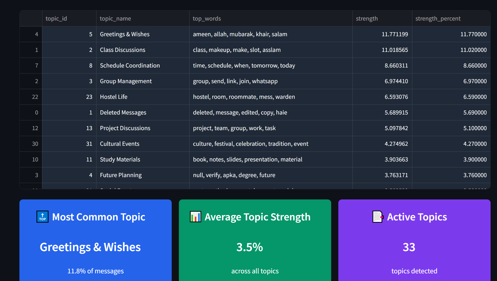
</p>

A powerful Python-based WhatsApp chat analyzer that transforms your conversations into meaningful insights through interactive visualizations. Uncover patterns, emotions, and topics within your chats with an easy-to-use interface.

## ✨ Key Features

- **📊 Advanced Analytics**: Message statistics, user engagement metrics, and activity patterns
- **🎭 Sentiment Analysis**: Understand the emotional tone of conversations 
- **🔍 Topic Modeling**: Automatically identify what topics are being discussed
- **📅 Time Comparison**: Compare conversation patterns across different time periods
- **🎨 Customizable Themes**: Choose from multiple visual themes for the dashboard
- **📱 Responsive Design**: Fully optimized for both mobile devices and desktop computers

## 📸 Screenshots

<details>
<summary><b>Welcome Screen</b></summary>
<p align="center">
  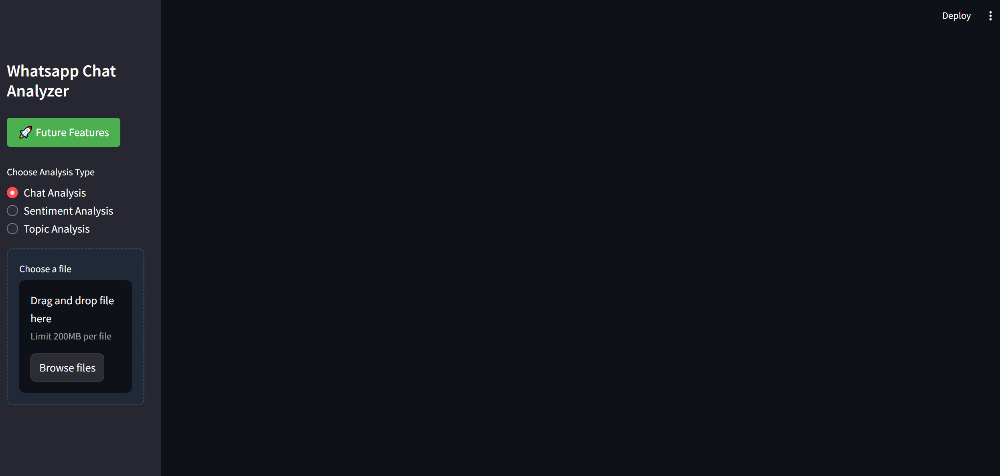
</p>
</details>

<details>
<summary><b>Chat Analysis Dashboard</b></summary>
<p align="center">
  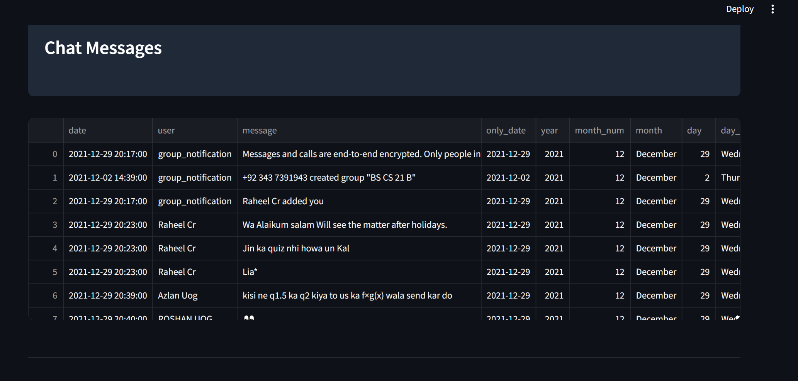
  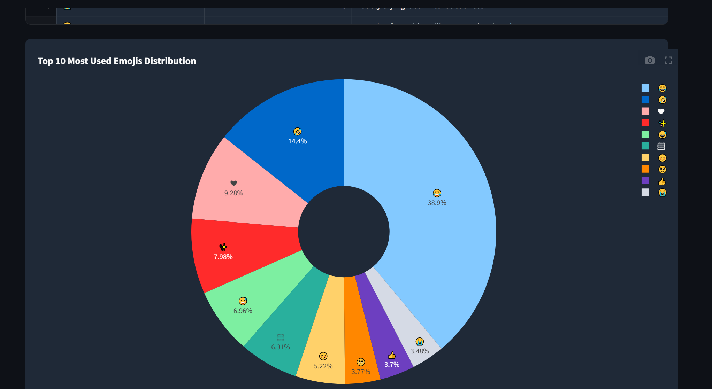
  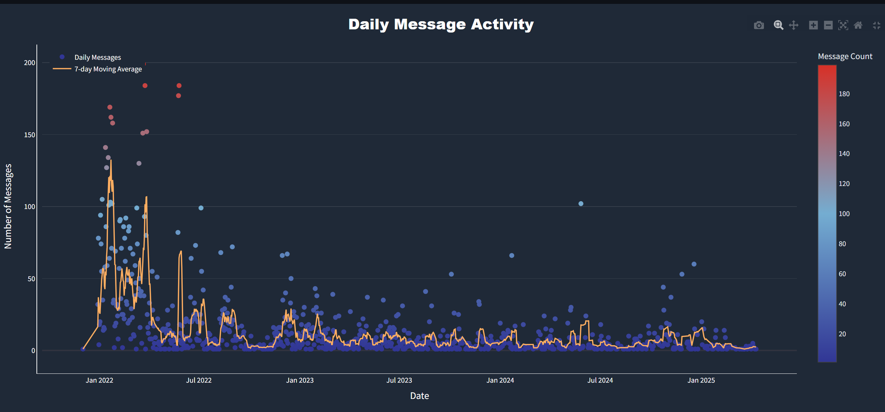
  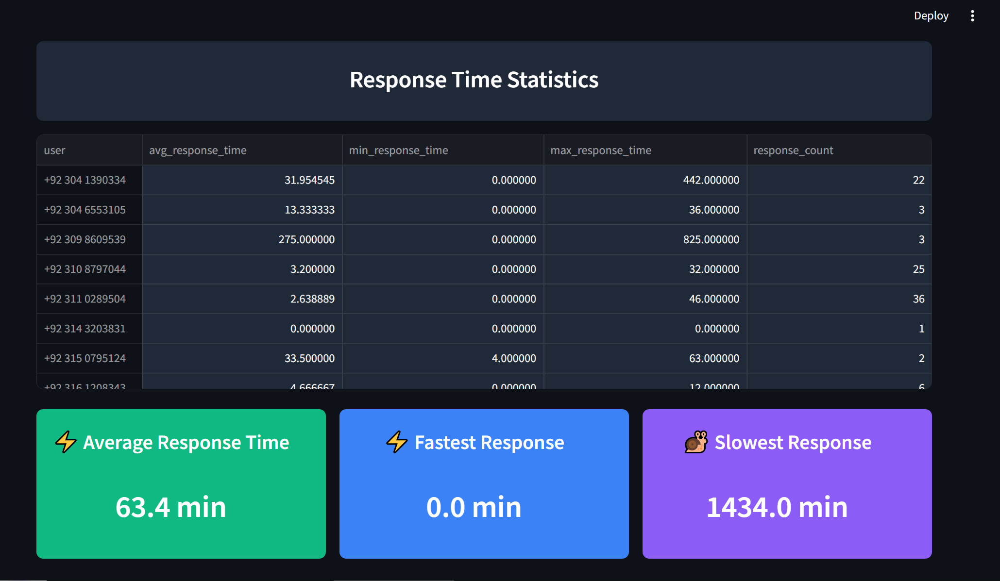
</p>
</details>

<details>
<summary><b>Sentiment Analysis</b></summary>
<p align="center">
  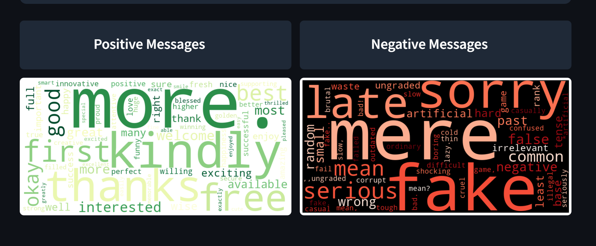
  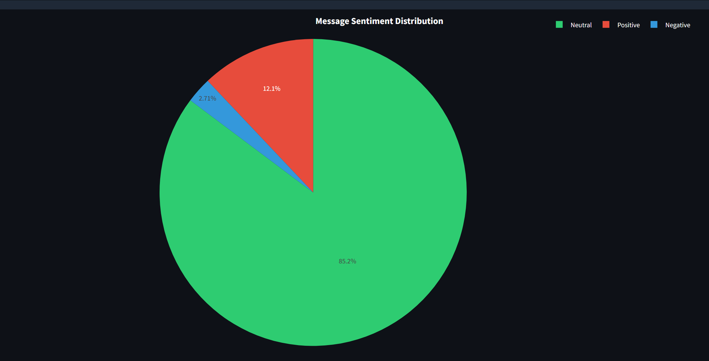
</p>
</details>

<details>
<summary><b>Time Comparison</b></summary>
<p align="center">
  
  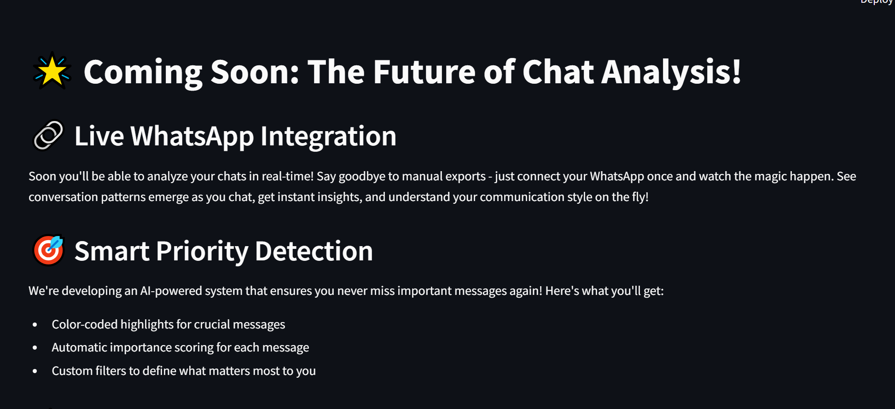
</p>
</details>

<details>
<summary><b>Topic Analysis</b></summary>
<p align="center">
  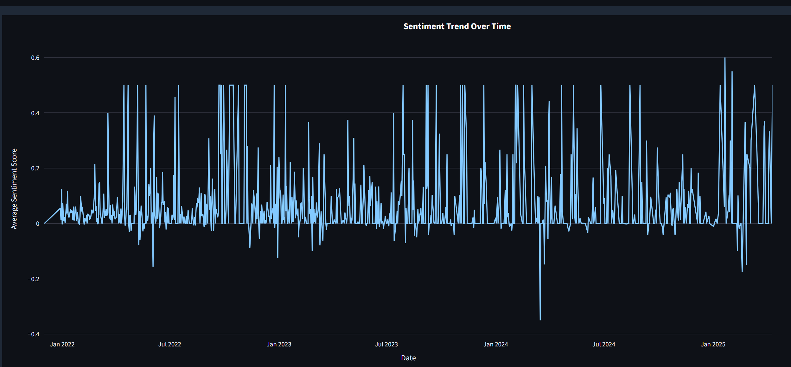
</p>
</details>

## 🚀 Getting Started

### Prerequisites

- Python 3.7+
- pip

### Installation

1. **Clone the repository**
   ```bash
   git clone https://github.com/Rana-Zaeem/Whats_app_chat_analyzer.git
   cd Whats_app_chat_analyzer
   ```

2. **Install required packages**
   ```bash
   pip install -r requirements.txt
   ```

3. **Run the application**
   ```bash
   streamlit run app.py
   ```

## 📋 How to Use

### Step 1: Export your WhatsApp chat
<p align="center">
  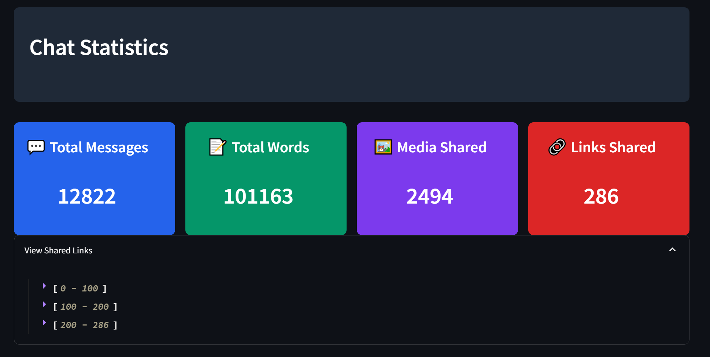
</p>

- Open WhatsApp on your phone
- Go to the chat you want to analyze
- Tap on ⋮ (three dots) > More > Export chat
- Choose 'Without Media'
- Send the exported file to your computer

### Step 2: Upload and analyze
- Launch the app using `streamlit run app.py`
- Upload the exported .txt file
- Select the type of analysis you want to perform
- Choose a specific user or analyze the entire chat
- Explore the visualizations and insights

## 📊 Analysis Types

### Chat Analysis
- Message count statistics
- User participation breakdown
- Word frequency analysis
- Emoji usage patterns
- Temporal activity patterns
- Response time analysis

### Sentiment Analysis
- Message sentiment classification (Positive/Negative/Neutral)
- Sentiment trends over time
- Emotional pattern detection
- Sentiment-based word clouds

### Topic Analysis
- Automated topic detection
- Key terms per topic
- Topic strength visualization

### Time Comparison
- Compare message volume across time periods
- Analyze changes in daily/hourly patterns
- Track user participation changes
- Identify conversation evolution

## 🔧 Technology Stack

- **Python 3.x** - Core programming language
- **Streamlit** - Web application framework
- **Pandas** - Data manipulation and analysis
- **NLTK & TextBlob** - Natural language processing
- **Plotly & Matplotlib** - Data visualization
- **WordCloud** - Text visualization
- **Scikit-learn** - Machine learning for topic modeling

## 📱 Responsive Design

The application is fully responsive and optimized for all devices:

- **Mobile-friendly interface**: All features work seamlessly on smartphones and tablets
- **Adaptive layout**: UI elements reorganize based on screen size
- **Touch-optimized controls**: Larger buttons and controls on touch devices
- **Responsive visualizations**: Charts and graphs scale appropriately for all screen sizes
- **Performance optimized**: Fast loading even on mobile connections

## 📁 Project Structure

```
whats_app_chat_analyzer/
│
├── app.py                # Main Streamlit application
├── preprocessor.py       # Data preprocessing module
├── helper.py             # Helper functions for analysis
├── sentiment.py          # Sentiment analysis module
├── topic_analysis.py     # Topic modeling and analysis
├── responsive_functions.py # Responsive design helpers
├── requirements.txt      # Python dependencies
├── packages.txt          # System dependencies
├── setup.sh              # Setup script for deployment
├── stop_hinglish.txt     # Custom stopwords
├── .streamlit/           # Streamlit configuration
│   ├── config.toml       # App configuration
│   └── style.css         # Custom CSS styles
└── README.md             # Project documentation
```

## 🤝 Contributing

Contributions are welcome! To contribute:

1. Fork the repository
2. Create your feature branch (`git checkout -b feature/amazing-feature`)
3. Commit your changes (`git commit -m 'Add some amazing feature'`)
4. Push to the branch (`git push origin feature/amazing-feature`)
5. Open a Pull Request

## 📄 License

This project is licensed under the MIT License - see the [LICENSE](LICENSE) file for details.

## 🙏 Acknowledgments

- [Streamlit](https://streamlit.io/) for the wonderful web app framework
- [WhatsApp](https://www.whatsapp.com/) for the chat export feature
- All contributors and users of this project